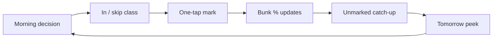
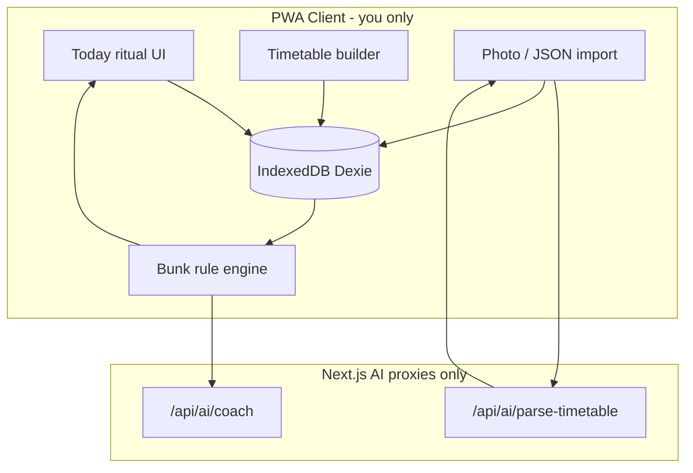

# AI Attendance System — Ultimate Plan (Personal Use Only)

**Related docs:** [Implementation Journal](./IMPLEMENTATION-JOURNAL.md) — living log of what changed and where it lives.

**Audience (locked):** **You only.** Track your own attendance after deploying on Vercel. Not a multi-user product.

**Product:** Personal self-tracker — mark Present/Absent, plan bunks, living timetable. Not institutional face/QR.

**North-star metric:** You can mark classes quickly and trust bunk % every day.

**Auth (locked):** **No login. No Clerk.**

**Storage (locked):** **IndexedDB via Dexie only** — data lives **inside your web browser** (or installed PWA) on that device. **No Postgres, MongoDB, Redis, or any cloud database** for v1. Clearing site data / uninstalling the PWA can wipe marks → use JSON export backup.

**Stack (locked):** Next.js App Router PWA · Dexie (browser IndexedDB) · Tailwind + shadcn · Groq · Gemini · **Vercel** · API keys server-only.

---

## Implementation todos

- [ ] Scaffold Next.js PWA + design tokens + Tailwind/shadcn + Dexie + env templates
- [ ] Fast onboarding + settings (criteria presets, buffer, semester, OD rules, export/import)
- [ ] Delightful timetable UX (day chips, copy day, extras, cancel/reschedule) + session materializer
- [ ] Today home: agenda checklist, now/next, one-tap mark, unmarked catch-up, impact line
- [ ] Bunk/recovery/risk engine + traffic-light subject rings + top decision banner
- [ ] Gemini vision timetable photo → editable preview → confirm into local DB
- [ ] Groq insight cards + grounded buddy chat (secondary to Today ritual)
- [ ] Month calendar, scenario bunk planner, JSON backup, PWA install, README, Vercel deploy

---

## Product thesis

Be your **daily eligibility co-pilot**: morning “can I bunk?”, after-class one-tap mark, evening catch-up — with a timetable that survives cancelled classes, extras, and mid-sem changes.

---

## Personal deploy & storage (locked — single user)

| Concern | Choice |
|---|---|
| Who uses it | **Only you** |
| Data | **Dexie → browser IndexedDB** (no separate DB server) |
| Host | **Vercel** hosts the app files/API only — **not** your attendance rows |
| Login / Clerk / Postgres / Mongo / Redis | **Not needed** |
| Backup | **Export/import JSON** in Settings (clearing site data wipes marks — back up) |
| AI keys | Your Groq + Gemini keys on Vercel env |

Install as **PWA on your phone** for daily use. Different devices = separate local data unless you export/import JSON.

---

## Daily ritual & features (P0)

- Today agenda + safe bunk strip + skip/attend impact line
- One-tap Present / Absent / Cancelled / Holiday / On Duty + undo
- Flexible timetable: day chips, copy day, cancel today, extra class, reschedule
- Criteria % (75/80/85) + buffer + traffic-light risk
- Gemini photo → editable preview → confirm
- Groq insights (secondary; rules always own the numbers)
- Month calendar, scenario bunk planner, JSON backup

---

## Architecture

---

## Data model (Dexie)

| Store | Essence |
|---|---|
| `settings` | semester, dates, targetPct, bufferPct, timezone, workingDays, odCountsAs, onboarded |
| `subjects` | name, shortCode, color, targetPct? |
| `timetableSeries` | subjectId, dayOfWeek, start/end, location?, effectiveFrom/To |
| `seriesExceptions` | cancelled \| modified for a date |
| `calendarBlocks` | holiday / break / exam ranges |
| `classSessions` | occurrenceKey, startsAt/endsAt, status, countsTowardAttendance |
| `attendanceRecords` | sessionId, status present\|absent\|late\|excused\|on_duty, markedAt |

Series = plan; sessions = reality. Attendance always on `classSessions`. Never delete marked sessions — cancel/void.

---

## Routes

| Route | Role |
|---|---|
| `/` | Today ritual |
| `/onboarding` | First-run |
| `/timetable` | Week builder |
| `/subjects` | Rings, bunks |
| `/calendar` | Month scan |
| `/import` | Gemini photo + JSON |
| `/insights` | Rule cards + Groq |
| `/plan` | Scenario bunk planner |
| `/settings` | Criteria, backup, theme |

---

## Implementation order

1. Scaffold Next.js PWA + Dexie + design tokens
2. Onboarding + settings + JSON backup
3. Timetable + materializer
4. Today ritual + marking
5. Bunk math + risk UI
6. Gemini import
7. Groq insights
8. Polish + **deploy on Vercel for your personal daily use**

---

## Out of scope (v1)

Multi-user, Clerk, Postgres/Mongo/Redis, face/geo, teacher portals. **Personal tracker only.**

**Later improvements (separate file):** [future-improvements.md](./future-improvements.md) — Clerk login/sessions, cloud sync, push nudges, AI v2, optional Redis/Postgres if you ever expand.

---

Cursor plan: `~/.cursor/plans/ai_attendance_system_b3d20ec6.plan.md`
